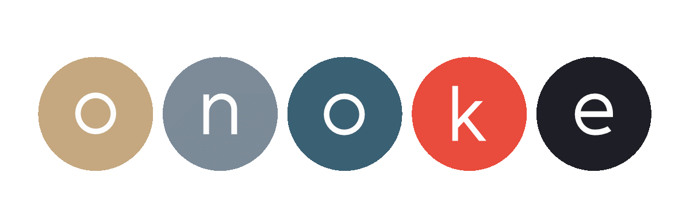
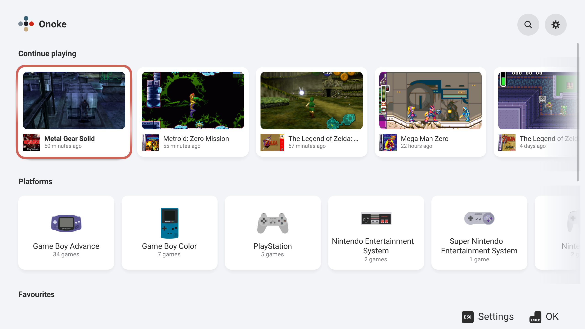
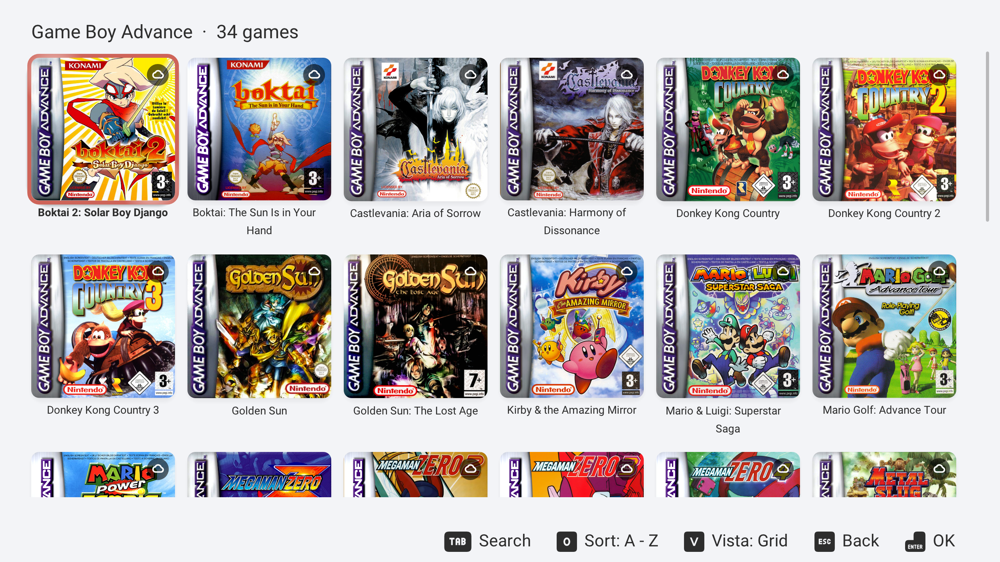
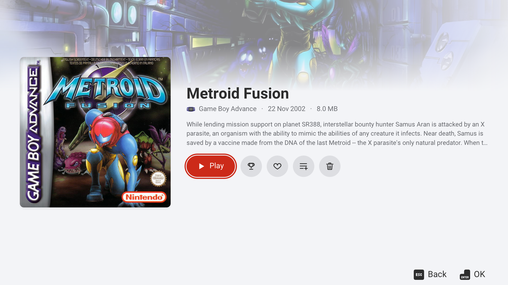
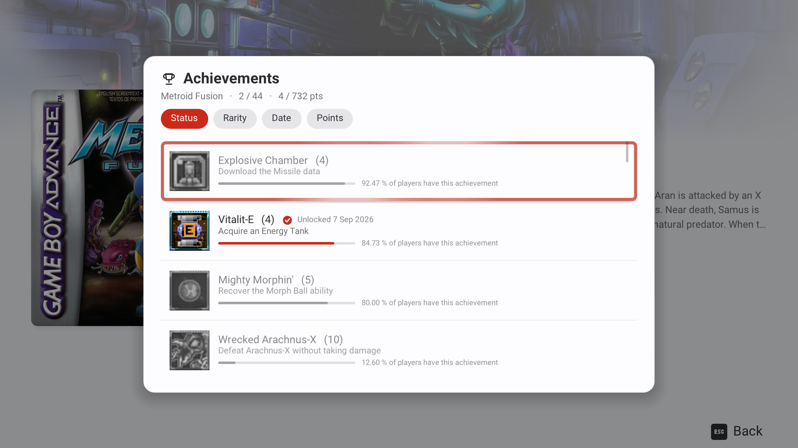
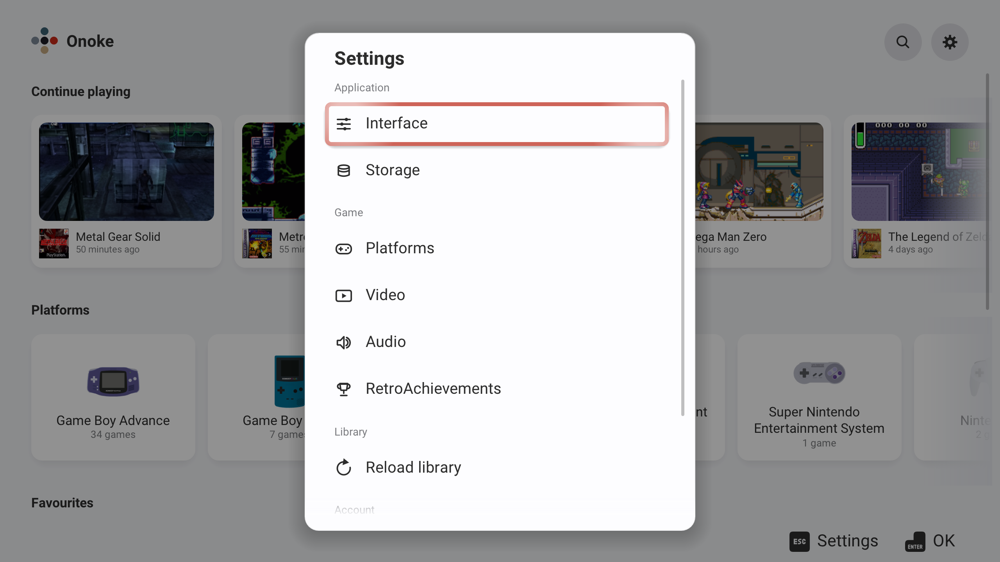

# What Onoke does

A [RomM](https://github.com/rommapp/romm) client for the **Nintendo Switch** (homebrew) and
for **Windows** that **is the emulator**: the games run inside it.

## The library

- Your own RomM account: your server, your user, your password.
- A home you arrange, and three ways to look at a system: grid, list or 3D boxes.
- Search, favourites and your own collections.
- Downloads keep going while you carry on using the app.

## Emulation

Cores are fetched from inside the app and update on their own.

**Switch** — NES, SNES, Game Boy / Color / Advance, Nintendo 64, Nintendo DS, PlayStation,
Mega Drive / Genesis, Sega CD, Master System, Game Gear, SG-1000, Dreamcast (with Naomi and
Atomiswave) and arcade (Neo Geo, CPS1-3).

**Windows** — the same, plus 3DS.

Core options, video and controls are all in the interface: no config files to edit.

## Saves

- Your saves follow you between the console and the PC, local and in the cloud.

## And

- RetroAchievements (hardcore mode not included yet).
- Controls per system and local multiplayer.
- Light and dark, eight accent colours.
- Spanish and English.

## What it does not do

- No games and no BIOS: the library is yours, on your server.
- No cores bundled: they are fetched or copied in, and keep their own licences.
